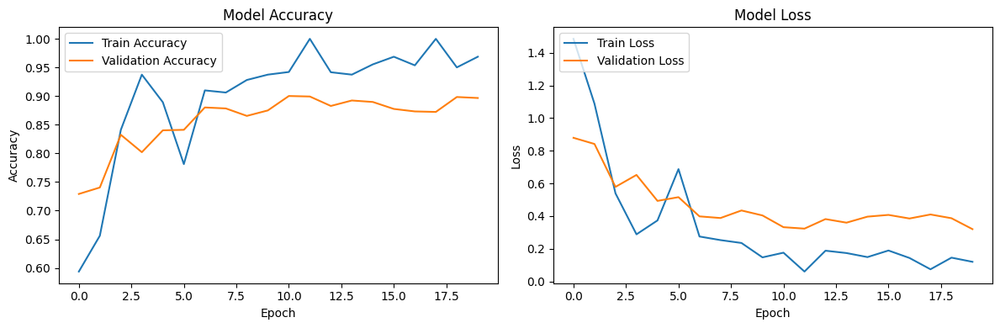
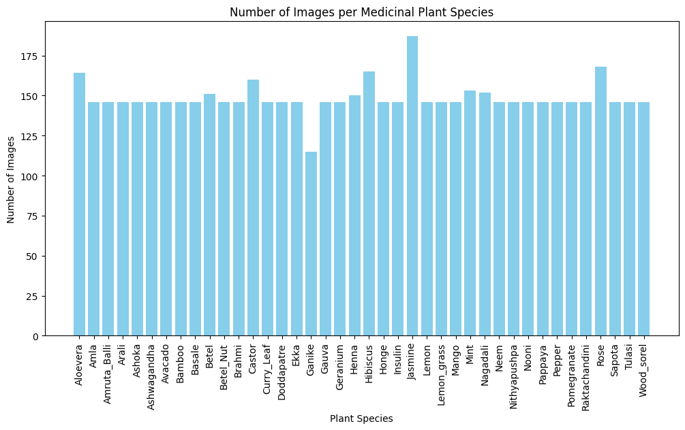

# 🌿 Medicinal Plant Identification System

<div align="center">
  
<!--  -->

**Identify medicinal plants with AI and access their healing properties in seconds**

[](https://www.python.org/downloads/)
[](https://www.tensorflow.org/)
[](https://flask.palletsprojects.com/)

</div>

## ✨ Features

- 🔍 **Instant Identification** - Upload any plant image for immediate classification
- 🧠 **Advanced AI** - Powered by deep learning CNN models with 93%+ accuracy
- 📚 **Medicinal Information** - Retrieves healing properties and traditional uses
- 🌐 **Google API Integration** - Fetches verified information from trusted sources

## 📸 Demo

<div align="center">
  <!-- gif for demo -->
  
<div align="center">
  
</div>

</div>

## 🏗️ Project Structure

```
├── 📁 static/          # Static assets (CSS, JS, Images)
├── 📁 templates/       # HTML templates
├── 📁 uploads/         # Temporary storage for user uploads
├── 📁 model/           # Pre-trained CNN model files
├── 📄 app.py           # Main Flask application
├── 📄 requirements.txt # Project dependencies
├── 📄 .env             # Environment variables (API keys)
└── 📄 README.md        # Project documentation
```

## 📊 Model Performance

<div align="center">
  
| 📈 Metric | 🔢 Value |
|-----------|---------|
| ✅ Accuracy | 93.75% |

<!-- analysis -->

<div align="center">
  
</div>

<div align="center">
  
</div>

</div>

## 🚀 Getting Started

### Prerequisites

- Python 3.10
- Google API Key (for medicinal information lookup)
- Custom Search Engine ID

### Installation

1. **Clone the repository**

```bash
git clone https://github.com/vjymisal0/medicinal-plant-identification.git
cd medicinal-plant-identification
```

2. **Create and activate a virtual environment**

```bash
python -m venv venv

# On Windows
venv\Scripts\activate

# On macOS/Linux
source venv/bin/activate
```

3. **Install dependencies**

```bash
pip install -r requirements.txt
```

4. **Set up environment variables**

Create a `.env` file in the root directory:

```
GOOGLE_API_KEY=your_google_api_key
SEARCH_ENGINE_ID=your_custom_search_engine_id
MODEL_PATH=./model/plant_classifier.h5
```

5. **Run the application**

```bash
python app.py
```

6. **Open your browser**

```
http://localhost:5000
```

## 💻 Usage

1. 📸 Upload a plant image through the web interface
2. 🧠 The AI model will classify the plant species
3. 📋 View detailed information including a reference link

## 🔧 Technical Implementation

- **Frontend**: HTML5, CSS3, JavaScript 
- **Backend**: Flask, Python 3.10
- **Model**: TensorFlow/Keras CNN architecture
- **APIs**: Google Custom Search API for additional information

## 👥 Contributors

- 👨‍💻 **Vijay Misal** - *Initial work and concept* - [GitHub](https://github.com/vjymisal0) - [LinkedIn](https://www.linkedin.com/in/vijaymisal/)
- 👩‍💻 **Mayuri Phad** - *Model training and optimization* - [GitHub](https://github.com/mayuriphad) - [LinkedIn](https://www.linkedin.com/in/mayuriphad/)

## 📚 Resources

- [Google Custom Search API Documentation](https://developers.google.com/custom-search/v1/introduction)
- [TensorFlow Documentation](https://www.tensorflow.org/guide)
- [Flask Documentation](https://flask.palletsprojects.com/en/2.0.x/)
<!-- - [Medicinal Plants Database](https://example.com/medicinal-plants) -->


<div align="center">
  
### 🌿 Connecting Nature's Wisdom with Modern Technology 🌿

⭐ **If you find this project useful, please consider giving it a star!** ⭐

</div>

